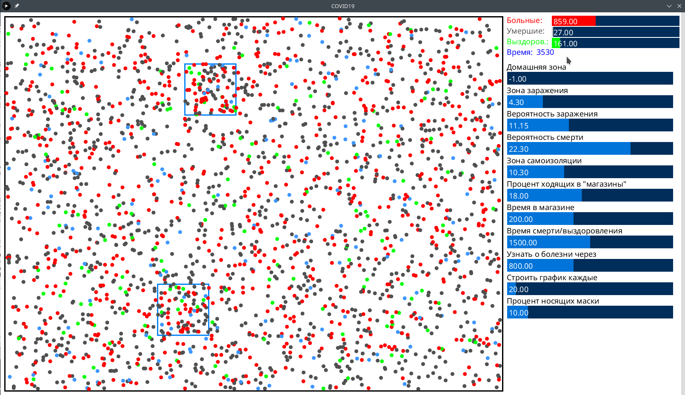
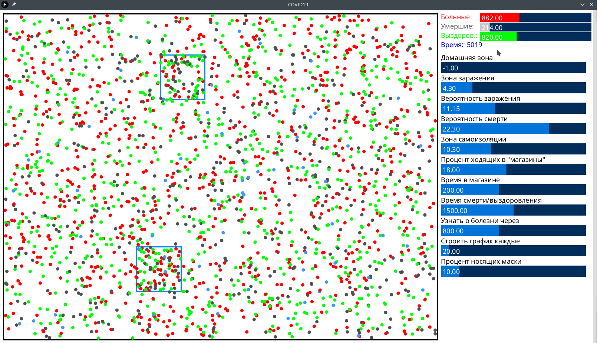
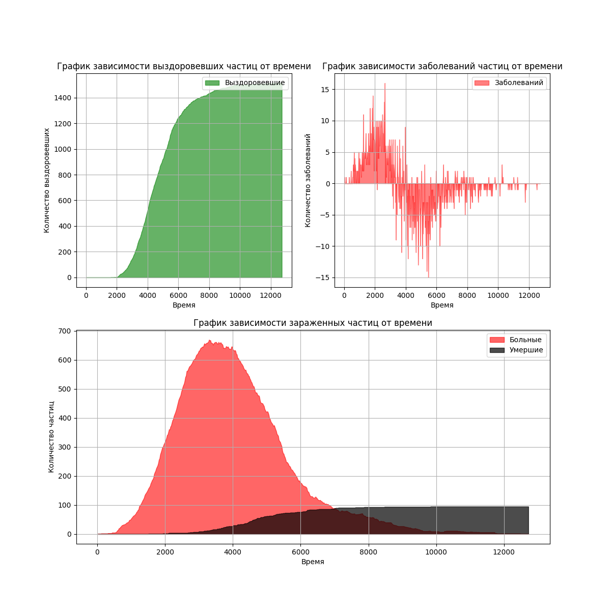
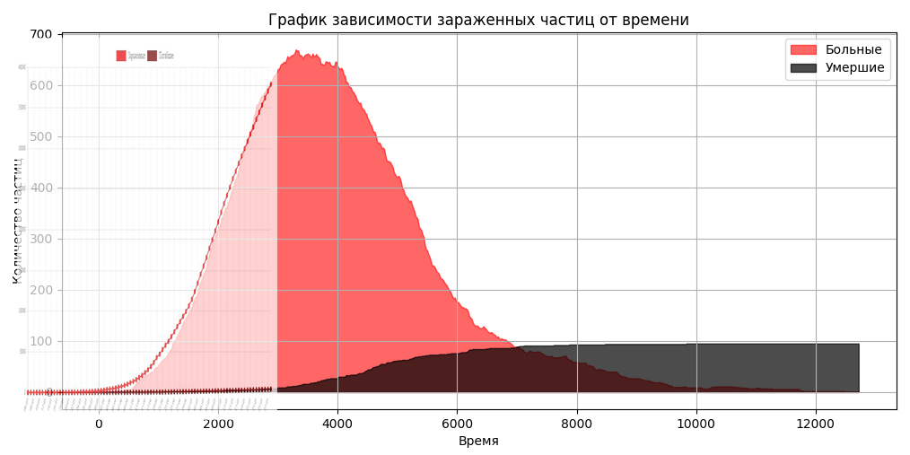
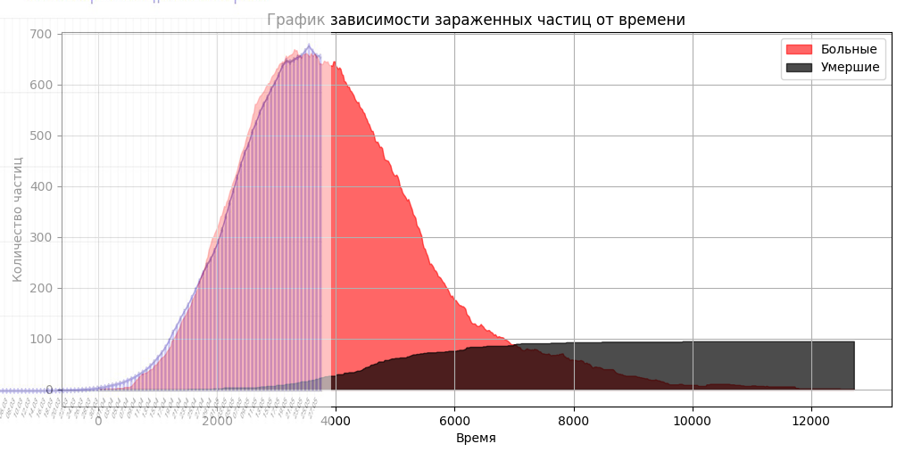
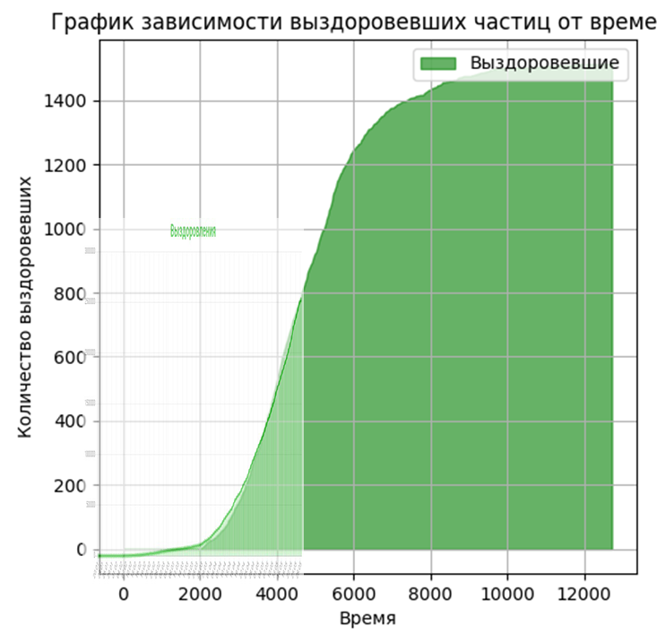
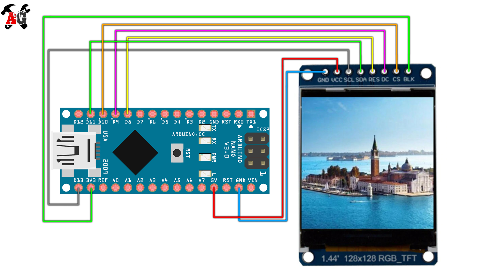

# Симулятор ~~корона~~вируса
Симулятор действий вируса с различными настройками, возможностью изменения их во время симуляции и построения графиков зараженных, умерших, выздоровевших.
### Среда симуляции
1) Основная программа симмуляции написана в [Processing](https://processing.org "Официальный сайт"). Его можно [скачать](https://processing.org/download "Скачать с официального сайта") для Windows, Linux и Mac OS X. 
2) Для создания графического интерфейса использовался модуль [control p5](https://github.com/sojamo/controlp5 "ссылка на github"), который можно установить внутри среды processing `Sketch → Import Library → Add Library → ControlP5` (`ControlP5` в поиске). Далее нажмите - `Install`.
3) Для построения графика необходим интерпретатор [Python](https://www.python.org "Официальный сайт") и модуль [matplotlib](https://pypi.org/project/matplotlib "Установить").
### Инструкция по пользованию
#### Интерфейс приложения
Экран разделен на 2 части (размеры можно задать в переменных). В левой части экрана проводится симуляция. Вы можете включить режим эмоджи или использовать цветные точки (параметр `emoji`). В правой выводится информация о количестве зараженных, умерших, выздоровевших, а также графический интерфейс **для изменения параметров симуляции в реальном времени**.

*Пример интерефейса приложения*

*Пример интерефейса приложения 2*

Настройки симуляции задаются в самом начале кода processing, они описаны в комментариях.
``` c
int AMOUNT = 2500;                // Количество частиц
int HOME_SIZE = 12;               // Домашняя зона частицы (-1 чтобы отключить)
int ISOLATION_SIZE = 6;           // Самоизоляционная (если частица знает) зона частицы (-1 чтобы отключить)

int DANGER_ZONE = 4;              // Радиус заражения частицы
int INFECTION_PROB = 8;           // Вероятность заражения
int DEATH_PROB = 6;               // Вероятность смерти (иначе - выздоровление)
byte SHOP_AMOUNT = 2;             // Количество магазинов
int SHOP_SIZE = 120;              // Размер магазинов (длина и ширина)
int SHOP_PROB = 18;               // Процент людей, которые ходят в магазины
int TIME_IN_SHOP = 200;           // Сколько времени в магазине проводит частица
byte FAMILY_SIZE = 3;             // Средний размер семьи
int MASK_PROB = 10;               // Процент частиц, носящих  маски (они заражаются, но носят маски и не заражают других)

int measPeriod = -1;              // Продолжительность симуляции (-1 чтобы отключить)
int deadCount = 1500;             // Смерть/выздоровление заражённого через (-1 чтобы отключить) 
int infectTime = 800;             // Время, через которое пациент узнает, что он болен 

int fps = 60;                     // FPS симуляции
boolean emoji = false;            // Эмодзи вместо точек (папка img)
boolean immunity_bool = true;     // Приобретается ли иммунитет после выздоровления?
boolean graph_text = true;        // Выводится тест или слайдер в кол-ве зараженных/выздоровевших ... (true - слайдер)
String log_name = "";             // Имя логов? Если "", то название автоматическое

int objSize = 9;                  // Диаметр частицы
int windowW = 1600;               // Ширина окна программы
int windowH = 900;                // Высота окна программы
int marginR = 420;                // Ширина информации справа
int graph_time = 20;              // Как часто снимать показания зараженных
```
Семья - `FAMILY_SIZE` человек, которые появляются в одном месте и там живут.
Под магазинами подразумеаются людные места. Они рисуются синими прямогольниками на поле.

Часть этих параметров можно изменять прямо во время симуляции слайдерами в правой чсти экрана. Благодаря этому Вы можете играть роль государства, вводя самоизоляцию, масочный режим, ограничения на посещение людных мест. Благадоря такой разносторонней настройке Вы сможете создать почти реальный вирус :)
*Код достаточно закомментирован, чтобы самому в нем разобраться и изменить что-то в коде*

### Графический интерфейс
Для управления параметрами во время симуляции используйте слайдеры с правой стороны экрана. Просто передвиньте слайдер и новое значение автоматически применится. Если границы значений, которые выставлены по умолчанию Вас не устраивают, то в строчках `96-138` просто изменить параметр `setRange(min, max)` в интересующем Вас значении. Также в параметре домашняя зона можно поставить отрицательное значение. Это эквивалентно отсутствию ограничений.
### Построение графиков
#### Пример графиков

Построение графиков осуществляется программой python `graphic.py` на основе логов, сделанных processing. Просто запустите программу  и введите имя лога, и в той же папке он появится в формате картинки. Также необходим установленный модуль `matplotlib` для python. 
### "Совпадения с реальным миром"
*Все совпадения с реальными графиками случайны, автор не несет ответственности за "точность" предсказний (совсем)*

*График зараженных в мире и полученный в программе*


*График зараженных в России и полученный в программе*


*График выздоровевших в мире и полученный в программе*


### Интересные фичи
- При нажатии на пробел можно поставить симуляцию на паузу и отредактировать параметры

*По мере разработки этот раздел будет пополняться*

## Обсуждение на форуме
https://community.alexgyver.ru/threads/simuljacija-koronavirusa.3077/

## Ссылки на компоненты для Ардуино-версии
- Arduino NANO https://ali.ski/so_g7c
- Дисплей https://ali.ski/nyESv

## Схема для Arduino-версии

