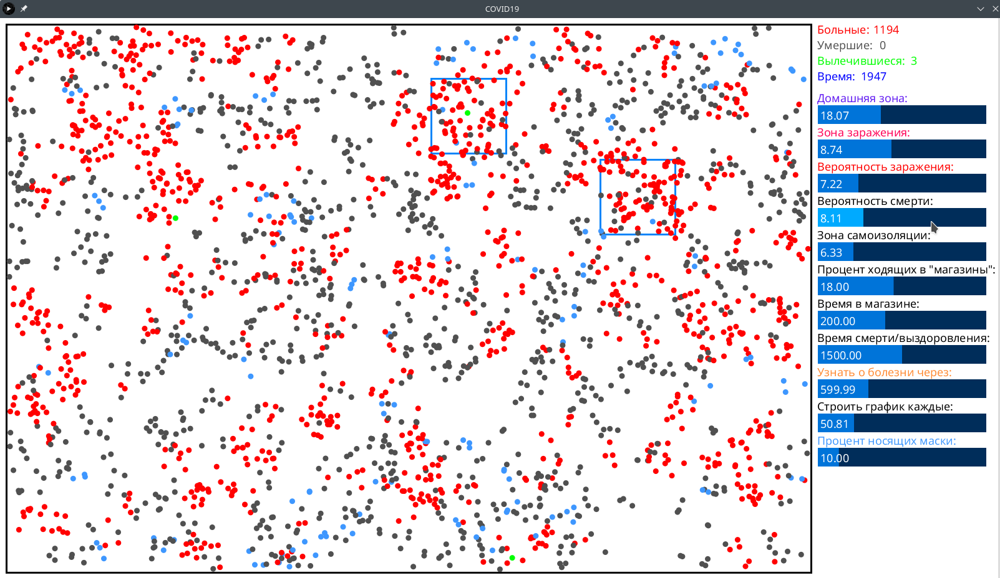
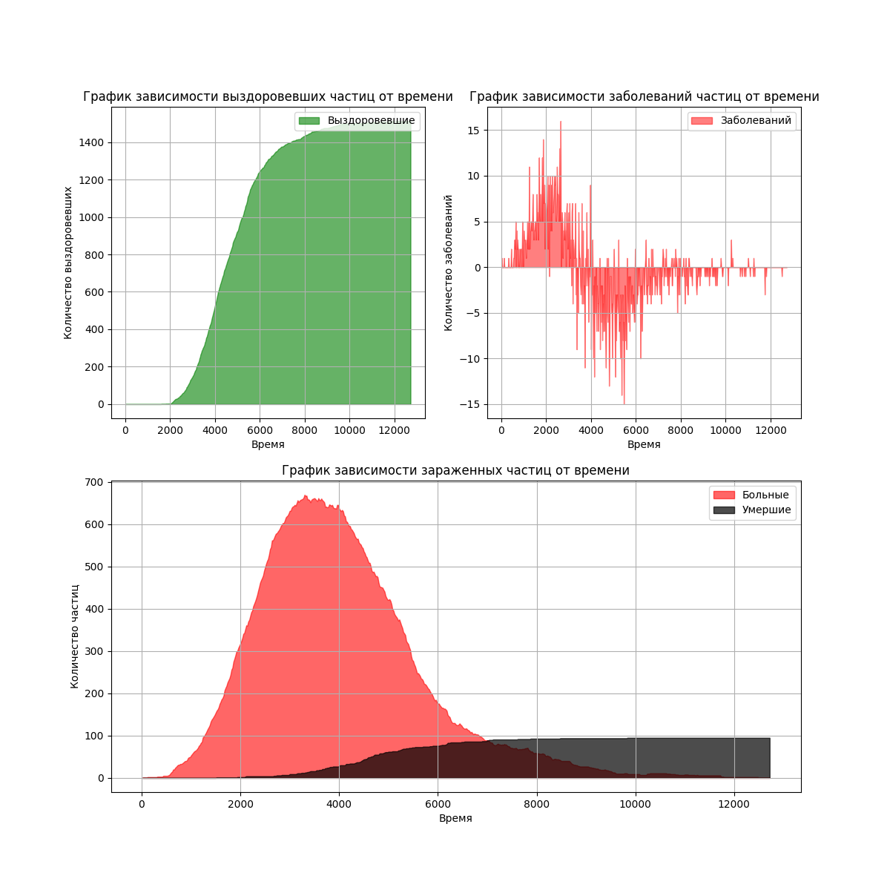

# Симулятор ~~корона~~вируса
Простой симулятор распространения вируса с различными настройками симулятора, возможностью изменения их во время симуляции и построения графиков зараженных, умерших, выздоровевших.
### Среда симуляции
1) Основная программа симмуляции написана в [Processing](https://processing.org "Официальный сайт"). Его можно [скачать](https://processing.org/download "Скачать с официального сайта") для Windows, Linux и Mac OS X. 
2) Для построения графика необходим интерпретатор [Python](https://www.python.org "Официальный сайт") и модуль [matplotlib](https://pypi.org/project/matplotlib "Установить").
### Инструкция по пользованию
#### Интерфейс приложения
Экран разделен на 2 части (размеры можно задать в переменных). В левой части экрана проводится симуляция. Вы можете включить режим эмоджи или использовать цветные точки (параметр `emoji`). В правой выводится информация о количестве зараженных, умерших, выздоровевших, а также в самом углу есть микроконсоль (описание смотреть ниже).

Настройки симуляции задаются в самом начале кода processing, они описаны в комментариях.
``` c
int AMOUNT = 2500;                // Количество частиц
int HOME_SIZE = 12;               // Радиус домашней зоны частицы (-1 чтобы отключить)
int ISOLATION_SIZE = 6;           // Радиус самоизоляционной (если частица знает, что она больна) зоны частицы (-1 чтобы отключить)

int DANGER_ZONE = 4;              // Радиус заражения частицы
int INFECTION_PROB = 8;           // Вероятность заражения
int DEATH_PROB = 6;               // Вероятность смерти (иначе - выздоровление)
int MASK_PROB = 10;               // Процент частиц, носящих  маски (они заражаются, но носят маски и не заражают других)
boolean immunity_bool = true;     // Приобретается ли иммунитет после выздоровления?

byte SHOP_AMOUNT = 2;             // Количество магазинов
int SHOP_SIZE = 120;              // Размер магазинов (длина и ширина)
int SHOP_PROB = 18;               // Процент людей, которые ходят в магазины
int TIME_IN_SHOP = 200;           // Сколько времени в магазине проводит частица

byte FAMILY_SIZE = 3;             // Средний размер семьи

int deadCount = 1500;             // Смерть/выздоровление заражённого через (-1 чтобы отключить) 
int infectTime = 800;             // Время, через которое пациент узнает, что он болен 

int fps = 60;                     // FPS симуляции
int measPeriod = -1;              // Продолжительность симуляции (-1 чтобы отключить)
boolean emoji = false;            // Эмодзи вместо точек (папка img)
String log_name = "";             // Имя логов? Если "", то название автоматическое

int objSize = 9;                  // Диаметр частицы
int windowW = 1600;               // Ширина окна программы
int windowH = 900;                // Высота окна программы
int marginR = 300;                // Ширина информации справа
int graph_time = 20;              // Как часто снимать показания зараженных
```
Семья - `FAMILY_SIZE` человек, которые появляются в одном месте и там живут.
Под магазинами подразумеаются людные места. Они рисуются синими прямогольниками на поле.

Часть этих параметров можно изменять прямо во время симуляции командами в маленькой импровизированной микроконсоли. Благодаря этому Вы можете играть роль государства, вводя самоизоляцию, масочный режим, ограничения на посещение людных мест. Благадоря такой разносторонней настройке Вы сможете создать почти реальный вирус :)

### Микроконсоль
Команда вводится с клавиатуры. Примеры: 
```
HOME_SIZE:       home=12
DANGER_ZONE:     dzone=4
INFECTION_PROB:  infec=8
DEATH_PROB:      death=6
ISOLATION_SIZE:  isolat=6
SHOP_PROB:       shop_p=18
TIME_IN_SHOP:    time_shop=200
deadCount:       dead_time=1500
infectTime:      infec_time=800
graph_time:      graph_time=20
MASK_PROB:       mask_prob=10
```
То есть сначала вводится имя переменной в моем сокращенном формате (указано сверху), например: `time_shop` затем любой символ (`=`/`-`/` `) и потом новое значение. Команда в итоге будет выглядеть, например, так `graph_time=100`. Чтобы значение применилось нажмите `Enter`.
### Построение графиков
#### Пример графиков

Построение графиков осуществляется программой python `graphic.py` на основе логов, сделанных processing. Просто запустите программу  и введите имя лога, и в той же папке он появится в формате картинки. Также необходим установленный модуль `matplotlib` для python. 
